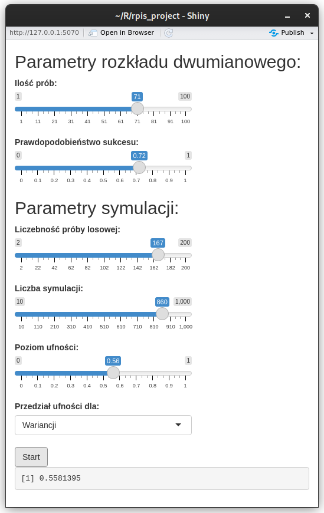
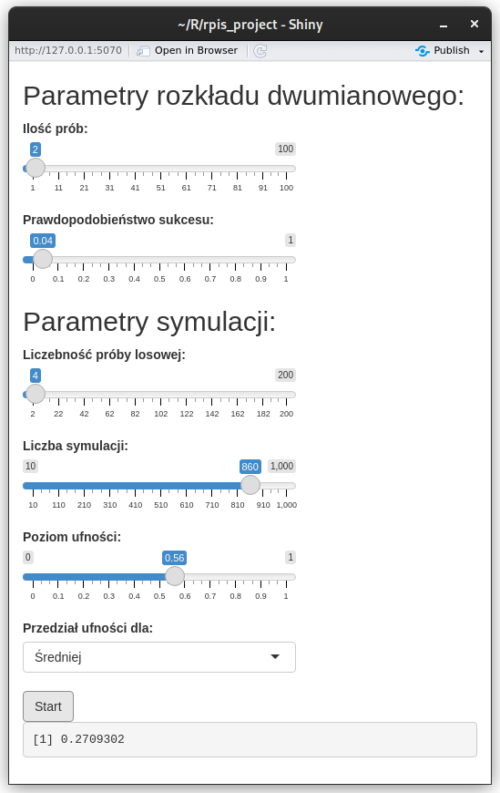

# Przedziały ufności - symulacja
### Opis programu
Program pozwala na doświadczalne wyznaczanie jakości przedziałów ufności dla rozkładu dwumianowego. Użytkownik
ma możliwość ustawienia parametrów rozkładu dwumianowego, takich jak ilość prób i prawdopodobieństwo sukcesu,
oraz parametrów symulacji, takich jak liczebność próby losowej, liczbę iteracji symulacji oraz oczekiwanego poziomu
ufności. Dodatkowo użytkownik może wybrać, czy chce symulować przedział ufności dla wariancji czy średniej.

### Opis symulacji
W każdej iteracji symulacji program generuje próbę losową o zadanej liczebności z rozkładu dwumianowego o zadanych
parametrach, a następnie na podstawie próby oblicza wartości górnej oraz dolnej granicy przedziału ufności dla
wybranego parametru. Obliczone wartości są następnie porównywane z teoretycznymi wartościami wariancji lub
średniej dla danego rozkładu dwumianowego. Jeśli wartość teoretyczna mieści się w przedziale ufności dla próby, to
dana iteracja jest uważana za sukces.

### Wyniki symulacji
Wartością wynikową jest procent symulacji, które zakończyły się sukcesem. Wartość ta powinna być zbliżona do
parametru poziomu ufności ustawionego przez użytkownika.
Wartości te będą odbiegać od siebie w przypadku, gdy nie zostaną spełnione założenia modelu przedziałów ufności.
Rozkład dwumianowy jest w przybliżeniu rozkładem normalnym tylko wtedy, gdy jego parametry ***np*** oraz ***np(1-p)***
(czyli średnia oraz wariancja) są większe od 5. Innym istotnym parametrem jest liczebność próby losowej, która musi być
odpowiednio duża, aby móc za jej pomocą określić parametry rozkładu.

### Przykład pozytywny
Odpowiednio duże wartości
parametrów ***n*** oraz ***p*** dla rozkładu oraz wielkość
próby przekładają się na bliską poziomowi ufności
wartość wynikową

### Przykład negatywny
Niskie wartości parametrów
***n*** oraz ***p*** oraz wielkości próby nie spełniają założeń
modelu, wartość wynikowa znacząco odbiega od
oczekiwanej.

